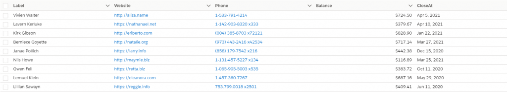
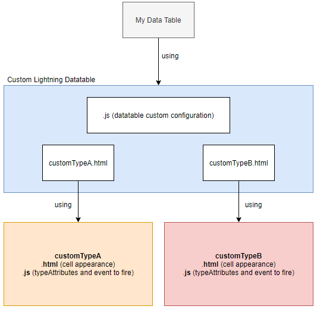
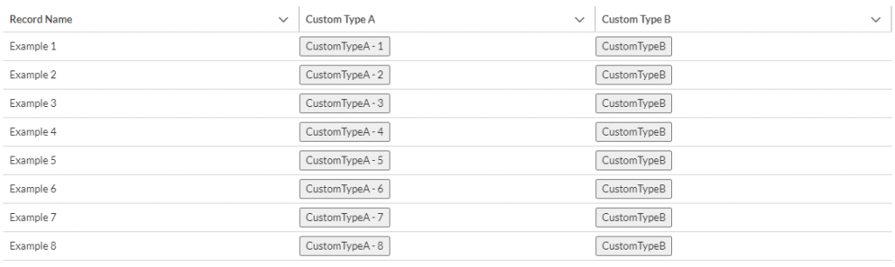

Hi guys,
Today I gonna show you how to define a custom data type in lightning-datatable and how to use it.

## What lightning-datatable is?

> A table that displays rows and columns of data. ~ Salesforce



We have many predefined types like:

- action
- boolean
- button
- button-icon
- currency
- date
- date-local
- email
- location
- number
- percent
- phone
- text
- URL

but sometimes we will have to create our own type to fulfill the client\'s requirements.

## Architecture



## How to define a custom type?




### Structure

```text
/lwc
    /customLightningDatatable
        /templates
            customTypeA.html
            customTypeB.html
        customLightningDatatable.html
        customLightningDatatable.js
        customLightningDatatable.js-meta.xml
    /customTypeA
        customTypeA.html
        customTypeA.js
        customTypeA.js-meta.xml
    /customTypeB
        customTypeB.html
        customTypeB.js
        customTypeB.js-meta.xml
```

- `customLightningDatatable` - extends `LightningDatatable` and contains cell custom types.
- `/templates` - contains all custom types. Not necessary, but nice way to have structure.

### 1. Create a Custom Data Type

- `.html` file contains how table cell will look like. It can be whatever you want. e.g button, picklist, link, etc.

```html
<template>
    <button onclick={fireCustomTypeA}>
        CustomTypeA - {customValueA}
    </button>
</template>
```

- `.js` file contains typeAttributes (as `@api` params). Event is optional - it's a way to make cell interactive. Not just display data.

```js
import { LightningElement, api } from 'lwc';

export default class CustomTypeA extends LightningElement {

    @api recordId;
    @api customValueA;

    fireCustomTypeA() {
        let newCustomValueA = this.customValueA + 1;

        const event = new CustomEvent('customtypea', {
            composed: true,
            bubbles: true,
            cancelable: true,
            detail: {
                recordId: this.recordId,
                newCustomValueA: newCustomValueA
            },
        });

        this.dispatchEvent(event);
    }
}
```

### 2. Create a Custom Lightning Datatable

- Custom datatable should extends `LightningDatatable` module.

```html
<template></template>
```

```js
import LightningDatatable from 'lightning/datatable';


export default class CustomLightningDatatable extends LightningDatatable {
    static customTypes = {}
}
```

### 3. Create a Custom Type Template

- Use component created in step 1.
- `value` comes from `fieldName` (columns configuration).
- You can pass more values to custom cell by adding `typeAttributes`.
- Place `.html` under `template` -> `template/customTypeA.html`

```html
<template>
    <c-custom-type-a
        record-id={value}
        custom-value-a={typeAttributes.customValueA}
    ></c-custom-type-a>
</template>
```

### 4. Use Custom Type in Custom Lightning Datatable

- Custom datatable should import Custom Type created in step 3.
- Add configuration to `customTypes` so you can pass more values as `typeAttributes`.

```js
import LightningDatatable from 'lightning/datatable';
import customTypeA from './templates/customTypeA';

export default class CustomLightningDatatable extends LightningDatatable {
    static customTypes = {
        customTypeA: {
            template: customTypeA,
            typeAttributes: ['customValueA']
        }
    }
}
```

#### 5. Use Custom Lightning Datatable

- Use case of the custom data table created in step 4.
- It contains all standard properties (the same as standard datatable) and our own like custom events.

```html
<template>
    <c-custom-lightning-datatable key-field="id"
                                  data={data}
                                  columns={columns}
                                  hide-checkbox-column
                                  oncustomtypea={handleCustomTypeA}>
    </c-custom-lightning-datatable>
</template>
```

```js
import { LightningElement, track } from 'lwc';

export default class MyDataTable extends LightningElement {

    columns = [
        {
            label: 'Record Name',
            fieldName: 'name',
            type: 'text'
        },
        {
            label: 'Custom Type A',
            fieldName: 'id',
            type: 'customTypeA',
            typeAttributes: {
                customValueA: {
                    fieldName: 'index'
                }
            }
        }
    ];

    @track data = [
        { id: 1, name: 'Example 1', index: 1, createdDate: '08-05-2020'},
        { id: 2, name: 'Example 2', index: 2, createdDate: '08-05-2020'},
        { id: 3, name: 'Example 3', index: 3, createdDate: '08-05-2020'},
        { id: 4, name: 'Example 4', index: 4, createdDate: '08-05-2020'},
        { id: 5, name: 'Example 5', index: 5, createdDate: '08-05-2020'},
        { id: 6, name: 'Example 6', index: 6, createdDate: '08-05-2020'},
        { id: 7, name: 'Example 7', index: 7, createdDate: '08-05-2020'},
        { id: 8, name: 'Example 8', index: 8, createdDate: '08-05-2020'}
    ];

    handleCustomTypeA(event) {
        const { recordId, newCustomValueA } = event.detail;
        console.log('CUSTOM TYPE A - ' + recordId + ' - ' + newCustomValueA);
        this.data.find(item => item.id == recordId).index = newCustomValueA;
        this.data = [...this.data]; //datatable will be rerender
    }
}
```

## Repository

[Github](https://github.com/pgajek2/custom-lightning-datatable-type)

---

If you have some questions feel free to ask in the comment section below. :)

Was it helpful? Check out our other great posts [here](https://beyondthecloud.dev/blog).

---

## Resource

1. [https://developer.salesforce.com/docs/component-library/bundle/lightning-datatable/example](https://developer.salesforce.com/docs/component-library/bundle/lightning-datatable/example)
2. [https://developer.salesforce.com/docs/component-library/documentation/lwc/lwc.events_propagation](https://developer.salesforce.com/docs/component-library/documentation/lwc/lwc.events_propagation)
