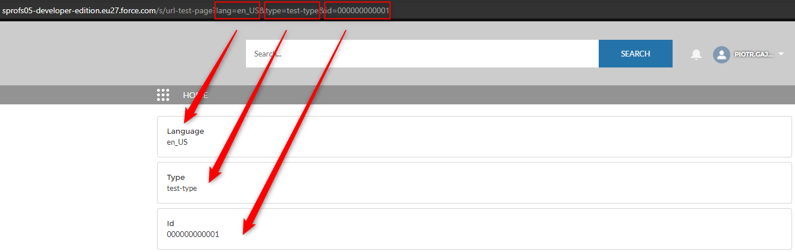

Hello Folks,
Today I wanna show you how to get URL parameters in the **LWC** component using **CurrentPageReference**.

Let\'s get started.

## Get URL parameters in LWC

Let\'s assume, that we have a case, where we need to get parameters from the URL in Lightning Web Component. The easiest way to do that will be to use CurrentPageReference, so we don\'t need to make any kind of magic in our code. Just simple code and we have everything that we need.

- *currentPageReference.state* - contains the key - value pairs of URL query parameters.
- *currentPageReference.state.parameterName* - allows to get specific param from URL.



```js
// currentPageReference
{
   attributes: {
      name: URL_Test_Page__c
   },
   state: {
      lang: en_US,
      type: test-type,
      id: 000000000001
   },
   type: comm__namedPage
}
```

As you can see on the screen above. **currentPageReference** include page API Name and type from [reference_type](http://).

These page reference types are supported.

- App - **standard__app**
- Lightning Component - **standard__component**
- Knowledge Article - **standard__knowledgeArticlePage**
- Login Page - **comm__loginPage**
- Named Page (Communities) - **comm__namedPage**
- Named Page (Standard) - **standard__namedPage**
- Navigation Item Page - **standard__navItemPage**
- Object Page - **standard__objectPage**
- Record Page - **standard__recordPage**
- Record Relationship Page - **standard__recordRelationshipPage**
- Web Page - **standard__webPage**

**Assumptions**

- Since the key-value pairs of `PageReference.state` are serialized to URL query parameters, all the values must be strings.
  For instance number will be in the 5 format.
- **@wire service getStateParameters will be fire automatically every time URL params will change.**

## Code

```js
import { LightningElement, wire } from 'lwc';
import { CurrentPageReference } from 'lightning/navigation';

export default class MyComponentName extends LightningElement {

    urlId = null;
    urlLanguage = null;
    urlType = null;

    @wire(CurrentPageReference)
    getStateParameters(currentPageReference) {
       if (currentPageReference) {
          this.urlId = currentPageReference.state?.id;
          this.urlLanguage = currentPageReference.state?.lang;
          this.urlType = currentPageReference.state?.type;
       }
    }
}
```

Was this helpful? Check out our other great posts [here](https://salesforceprofs.com/blog).

## Resources

- [](https://developer.salesforce.com/docs/component-library/bundle/lightning-navigation/documentation)[https://developer.salesforce.com/docs/component-library/bundle/lightning-navigation/documentation](https://developer.salesforce.com/docs/component-library/bundle/lightning-navigation/documentation)
- [https://developer.salesforce.com/docs/component-library/documentation/en/lwc/use_navigate_add_params_ur](https://developer.salesforce.com/docs/component-library/documentation/en/lwc/use_navigate_add_params_url)l
