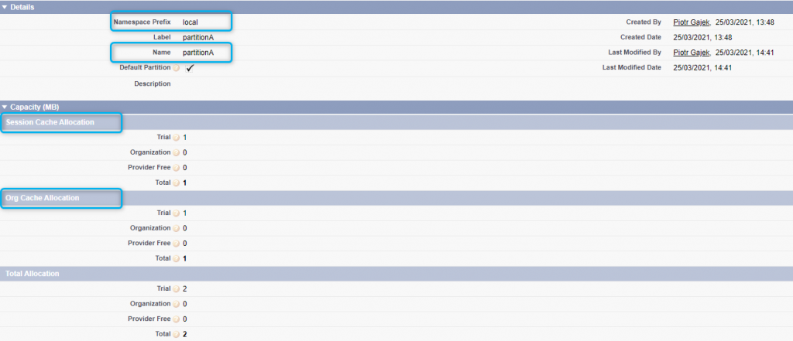

Hello devs,
plat
**Platform Cache** is a Salesforce feature, which allows you provides faster performance and better reliablity. Frequently used data are stored in memory layer, so can be easily accessed by your applications without additional SOQL or API request. With Platform Cache, you can also allocate cache space so that some apps or operations don\'t steal capacity from others.

Let\'s begin.

---

# What is Cache?

**Cache** is a temporary storage, which keeps frequently using data. It makes your application really fast, because instead of retrieving data you have them at hand. Cache is basically, used to reduce the average time to access data from database/API requests.

**Real life example:** Let\'s assume that you like milk ?. You keep it in your fridge (**cache**), which is easily accessible and faster for whole shopping process. However, if you cannot find there your lovely milk (**data**), what you need to do? Buy a cow or go shopping (**database/API request**). ?

---

## Platform Cache

> The Platform Cache API lets you store and retrieve data that’s tied to Salesforce sessions or shared across your org. Put, retrieve, or remove cache values by using the Session, Org, SessionPartition, and OrgPartition classes in the Cache namespace. ~ **Salesforce** What we can cache? - Static data as object metadata or user profile - Apex list of sObjects, String, Integers, etc. - Apex Sets, Maps. - Records or sObject results of SOQL query - API callouts data ### Platform Cache Types In Salesforce we can highlight two types of Platform Cache namely, **Org** and **Sassion** Cache.

#### Org Cache

> Stores data that any user in an org reuses. For example, the contents of navigation bars that dynamically display menu items based on user profile are reused. Unlike session cache, org cache is accessible across sessions, requests, and org users and profiles. Org cache expires when its specified time-to-live (ttlsecs value) is reached. ~ **Salesforce**

```java
// *****************************************************************************************************************
// General Rules for Platform Cache in Apex Code
// Org Class
// PUT
Cache.Org.put('NAMESPACE_PREFIX_HERE.PARTITION_NAME_HERE.YOUR_KEY_HERE', YOUR_VALUE_HERE);
// GET
Cache.Org.get('NAMESPACE_PREFIX_HERE.PARTITION_NAME_HERE.YOUR_KEY_HERE');

// OrgPartition Class
// PUT
Cache.OrgPartition VAR_NAME = Cache.Org.getPartition('NAMESPACE_PREFIX_HERE.PARTITION_NAME_HERE');
VAR_NAME.put('YOUR_KEY_HERE', YOUR_VALUE_HERE);
// GET
Cache.OrgPartition VAR_NAME = Cache.Org.getPartition('NAMESPACE_PREFIX_HERE.PARTITION_NAME_HERE');
VAR_NAME.get('YOUR_KEY_HERE');
// *****************************************************************************************************************

//Example:
String namespace = 'local';
String partitionAName = 'partitionA';
String partitionACacheBase = namespace + '.' + partitionAName; //'local.partitionA'
String firstNameKey = 'userFirstName';
String lastNameKey = 'userLastName';

String myFirstNameFromCache = null;
String myLastNameFromCache = null;

String firstNameCacheKey = partitionACacheBase + '.' + firstNameKey; //'local.partitionA.userFirstName'
String lastNameCacheKey = partitionACacheBase + '.' + lastNameKey; //'local.partitionA.userLastName'

// ORG CACHE
// Partition A | Cache.Org methods
Cache.Org.put(firstNameCacheKey, 'OrgPlatform');
Cache.Org.put(lastNameCacheKey, 'OrgCache');

if (Cache.Org.contains(firstNameCacheKey)) {
    myFirstNameFromCache = (String) Cache.Org.get(firstNameCacheKey);
}
if (Cache.Org.contains(lastNameCacheKey)) {
    myLastNameFromCache = (String) Cache.Org.get(lastNameCacheKey);
}

System.debug('------ Cache.Org methods ------');
System.debug('myFirstNameFromCache: ' + myFirstNameFromCache);
System.debug('myLastNameFromCache: ' + myLastNameFromCache);

// Partition A | Cache.OrgPartition methods
Cache.OrgPartition orgAPartition = Cache.Org.getPartition(partitionACacheBase); //'local.partitionA'

orgAPartition.put(firstNameKey, 'OrgSalesforce');
orgAPartition.put(lastNameKey, 'OrgProfs');

if (orgAPartition.contains(firstNameKey)) {
    myFirstNameFromCache = (String) orgAPartition.get(firstNameKey);
}
if (orgAPartition.contains(lastNameKey)) {
    myLastNameFromCache = (String) orgAPartition.get(lastNameKey);
}

System.debug('------ Cache.OrgPartition methods ------');
System.debug('myFirstNameFromCache: ' + myFirstNameFromCache);
System.debug('myLastNameFromCache: ' + myLastNameFromCache);
```

#### Session Cache

> Stores data for individual user sessions. For example, in an app that finds customers within specified territories, the calculations that run while users browse different locations on a map are reused. Session cache lives alongside a user session. The maximum life of a session is eight hours. Session cache expires when its specified time-to-live (ttlsecs value) is reached or when the session expires after eight hours, whichever comes first. ~ **Salesforce**

```java
// *****************************************************************************************************************
// General Rules for Platform Cache in Apex Code
// Session Class
// PUT
Cache.Session.put('NAMESPACE_PREFIX_HERE.PARTITION_NAME_HERE.YOUR_KEY_HERE', YOUR_VALUE_HERE);
// GET
Cache.Session.get('NAMESPACE_PREFIX_HERE.PARTITION_NAME_HERE.YOUR_KEY_HERE');

// SessionPartition Class
// PUT
Cache.SessionPartition VAR_NAME = Cache.Session.getPartition('NAMESPACE_PREFIX_HERE.PARTITION_NAME_HERE');
VAR_NAME.put('YOUR_KEY_HERE', YOUR_VALUE_HERE);
// GET
Cache.OrgPartition VAR_NAME = Cache.Session.getPartition('NAMESPACE_PREFIX_HERE.PARTITION_NAME_HERE');
VAR_NAME.get('YOUR_KEY_HERE');
// *****************************************************************************************************************

//Example:
String namespace = 'local';
String partitionAName = 'partitionA';
String partitionACacheBase = namespace + '.' + partitionAName; //'local.partitionA'
String firstNameKey = 'userFirstName';
String lastNameKey = 'userLastName';

String myFirstNameFromCache = null;
String myLastNameFromCache = null;

String firstNameCacheKey = partitionACacheBase + '.' + firstNameKey; //'local.partitionA.userFirstName'
String lastNameCacheKey = partitionACacheBase + '.' + lastNameKey; //'local.partitionA.userLastName'

// SESSION CACHE
// Partition A | Cache.Session methods
Cache.Session.put(firstNameCacheKey, 'SessionPlatform'); // Cache.Session.put('local.partitionA.userFirstName', 'SessionPlatform');
Cache.Session.put(lastNameCacheKey, 'SessionCache'); // Cache.Session.put('local.partitionA.userLastName', 'SessionPlatform');

if (Cache.Session.contains(firstNameCacheKey)) {
    myFirstNameFromCache = (String) Cache.Session.get(firstNameCacheKey);
}
if (Cache.Session.contains(lastNameCacheKey)) {
    myLastNameFromCache = (String) Cache.Session.get(lastNameCacheKey);
}

System.debug('------ Cache.Session methods ------');
System.debug('myFirstNameFromCache: ' + myFirstNameFromCache);
System.debug('myLastNameFromCache: ' + myLastNameFromCache);

// Partition A | Cache.SessionPartition methods
Cache.SessionPartition sessionAPartition = Cache.Session.getPartition(partitionACacheBase); //'local.partitionA'

sessionAPartition.put(firstNameKey, 'SessionSalesforce');
sessionAPartition.put(lastNameKey, 'SessionProfs');

if (sessionAPartition.contains(firstNameKey)) {
    myFirstNameFromCache = (String) sessionAPartition.get(firstNameKey);
}
if (sessionAPartition.contains(lastNameKey)) {
    myLastNameFromCache = (String) sessionAPartition.get(lastNameKey);
}

System.debug('------ Cache.SessionPartition methods ------');
System.debug('myFirstNameFromCache: ' + myFirstNameFromCache);
System.debug('myLastNameFromCache: ' + myLastNameFromCache);
```

### Summary

Type | Access | Min time-to-live | Max time-to-live | Max size of single Cached Item | Maximum local cache size for a partition (per-request)
---- | ------ |-----------------|------------------| ------------------------------ | ------------------------------------------------------
**`Session Cache`** | Only current user | 300 seconds (5 minutes) | up to 8h (28 800 seconds)| 100 kB | 500 kB
**`Org Cache`** | All users | 300 seconds (5 minutes) | up to 48h (172 800 seconds) | 100 kB | 1 000 kB
- Cache isn’t persisted. There’s no guarantee against data loss. We should always check if data in cache exist and if not, retrieve data from database.
- Cache misses can happen.
- Partitions must adhere to the limits within Salesforce.
- Data in the cache isn’t encrypted.
- Some or all cache is invalidated when you modify an Apex class in your org.
- No saving order. Two different transactions have a race, who win, those data will be save.

---
## Create Platform Cache Step by Step?

### Define Platform Cache in Salesforce
1. Go to `Setup` > `Platform Cache` (under Custom Code) > Click `New Platform Cache Partition`
2. Define Partition `Label` and `Name`.
3. `Default Partition` allows you write following code:
    ```java
    // Instead of it:
    Cache.Session.put('local.partitionA.userFirstName', 'myDataToStoreString');
    // You can do this:
    Cache.Session.put('userFirstName', 'myDataToStoreString');
    // userFirstName (key) will be save with 'myDataToStoreString' (value) to partition marked as default.
    // We can have only one default partition.
    ```
4. `Session Cache Allocation` here we can define storage size for Session Cache. If we will leave it `0` we will be not able to put values.
5. `Org Cache Allocation` here we can define storage size for Org Cache. If we will leave it `0` we will be not able to put values. 

### Prepare Your Apex Code
```js
// General Rules for Platform Cache in Apex Code
// PUT
Cache.CACHE_TYPE_HERE.put('NAMESPACE_PREFIX_HERE.PARTITION_NAME_HERE.YOUR_KEY_HERE', YOUR_VALUE_HERE);
// GET
Cache.CACHE_TYPE_HERE.get('NAMESPACE_PREFIX_HERE.PARTITION_NAME_HERE.YOUR_KEY_HERE');

// Partition Class
// PUT
Cache.CACHE_TYPEPartition VAR_NAME = Cache.CACHE_TYPE.getPartition('NAMESPACE_PREFIX_HERE.PARTITION_NAME_HERE');
VAR_NAME.put('YOUR_KEY_HERE', YOUR_VALUE_HERE);
// GET
Cache.CACHE_TYPEPartition VAR_NAME = Cache.CACHE_TYPE.getPartition('NAMESPACE_PREFIX_HERE.PARTITION_NAME_HERE');
VAR_NAME.get('YOUR_KEY_HERE');

// Examples:
// Session Class
Cache.Session.put('local.partitionA.userFirstName', 'Session-Salesfroce');
Cache.Session.put('local.partitionA.userLastName', 'Session-Profs');

String firstNameFromSessionCache = Cache.Session.get('local.partitionA.userFirstName', 'Session-Salesfroce');
String lastNameFromSessionCache = Cache.Session.get('local.partitionA.userLastName', 'Session-Profs');

// Session Partition Class
Cache.SessionPartition sessionAPartition = Cache.Session.getPartition('local.partitionA');

sessionAPartition.put('userFirstName', 'SessionSalesforce');
sessionAPartition.put('userLastName', 'SessionProfs');

String firstNameFromSessionCache = (String) sessionAPartition.get('userFirstName');
String lastNameFromSessionCache = (String) sessionAPartition.get('userLastName');

// Org Class
Cache.Org.put('local.partitionA.userFirstName');
Cache.Org.put('local.partitionA.userLastName');

String firstNameFromOrgCache = Cache.Org.get('local.partitionA.userFirstName');
String lastNameFromOrgCache = Cache.Org.get('local.partitionA.userLastName');

// Org Partition Class
Cache.OrgPartition orgAPartition = Cache.Org.getPartition('local.partitionA');

orgAPartition.put('userFirstName', 'SessionSalesforce');
orgAPartition.put('userLastName', 'SessionProfs');

String firstNameFromSessionCache = (String) orgAPartition.get('userFirstName');
String lastNameFromSessionCache = (String) orgAPartition.get('userLastName');
```

### Apex method with cache logic

```java
public static String getUserProfileName() {

	Cache.OrgPartition profilePartition = Cache.Org.getPartition('local.ProfileData'); // ProfileData is my partition name

	String userProfileName = (String) profilePartition.get(UserInfo.getProfileId());

	if (String.isBlank(userProfileName)) {
		Profile currentUserProfile = [ SELECT Id, Name
				 					   FROM Profile
									   WHERE Id = :UserInfo.getProfileId() ];
		userProfileName = currentUserProfile.Name;
        profilePartition.put(UserInfo.getProfileId(), userProfileName, 86400);
    }

	return userProfileName;
}
```

You can wondering why I didn\'t use `profilePartition.contains(UserInfo.getProfileId())`?

> Avoid calling the contains(key) method followed by the get(key) method. If you intend to use the key value, simply call the get(key) method and make sure that the value is not equal to null. ~ **Salesforce**

---

## Cache.CacheBuilder Interface?

> A Platform Cache best practice is to ensure that your Apex code handles cache misses by testing for cache requests that return null. You can write this code yourself. Or, you can use the Cache.CacheBuilder interface, which makes it easy to safely store and retrieve values to a session or org cache. ~ **Salesforce**

We can transform my method:

```java
public static String getCurrentUserProfileName() {

	Cache.OrgPartition profilePartition = Cache.Org.getPartition('local.ProfileData'); // ProfileData is my partition name

	String userProfileName = (String) profilePartition.get(UserInfo.getProfileId());

	if (String.isBlank(userProfileName)) {
		Profile currentUserProfile = [ SELECT Id, Name
				 					   FROM Profile
									   WHERE Id = :UserInfo.getProfileId() ];
		userProfileName = currentUserProfile.Name;
        profilePartition.put(UserInfo.getProfileId(), userProfileName, 86400);
    }

	return userProfileName;
}

// Use
String currenUserProfile = getCurrentUserProfileName();
```

to the following Apex Class:
```java
public class ProfileInfoCache implements Cache.CacheBuilder {
    public Object doLoad(String profileId) {
        return (Profile)[ SELECT Id, Name
                          FROM Profile
                          WHERE Id = :profileId ];
    }
}

// Use
Profile currenUserProfileDetails = (Profile) Cache.Org.get(ProfileInfoCache.class, UserInfo.getProfileId());
String currenUserProfile = currenUserProfileDetails.Name;
```

**Note!**
- **When you run get `Cache.Org.get(ProfileInfoCache.class, UserInfo.getProfileId());`, Salesforce tying to find cached data by unique key and if there is no data, fire doLoad() method, caches retrived data, and then return it.**
- The doLoad(String var) method must take a String parameter, even if you do not use the parameter in the method’s code.
- The class that implements CacheBuilder must be non-static.
- The doLoad(String var) method can return any value, including null. If a null value is returned, it is delivered directly to the CacheBuilder consumer and not cached.

---

## Platform Cache use cases?

- Reused throughout a session
- Reduce number of SOQL statements
- Static (not rapidly changing)
- Public transit schedule
- Company shuttle bus schedule
- Tab headers that all users see
- A static navigation bar that appears on every page of your app
- A user’s shopping cart that you want to persist during a session
- Daily snapshots of exchange rates (rates fluctuate during a day)
- User Profile Name data
- Expensive to compute or retrieve
- Total sales over the past week
- Total volunteering hours company employees did as a whole
- Top sales ranking

---

## Platform Cache Best Practices?

- Ensure that your code handles cache misses by testing cache requests that return null.
- To help improve performance, perform cache operations on a list of keys rather than on individual keys.
- It’s more efficient to cache a few large items than to cache many small items separately.
- Avoid calling the contains(key) method followed by the get(key) method.
- Clear the cache only when necessary.

### Limitations

- When the cache partition limit is reached, keys are evicted until the cache is reduced to 100% capacity. Platform Cache uses a least recently used (LRU) algorithm to evict keys from the cache.

Edition | Cache Size
--------| ----------
Enterprise | 10 MB
Unlimited and Performance | 30 MB
All others |0 MB

Limit | Value
------| ----------
Minimum partition size | 1 MB

---

Was it helpful? Check out our other great posts [here](https://beyondthecloud.dev/blog).

---

## References

- [Salesforce Developer - Platform Cache](https://developer.salesforce.com/docs/atlas.en-us.apexcode.meta/apexcode/apex_cache_namespace_overview.htm)
- [Salesforce Trainlhead - Platform Cache](https://trailhead.salesforce.com/en/content/learn/modules/platform_cache/platform_cache_get_started)
- [Salesforce Developer Blog](https://developer.salesforce.com/blogs/2020/06/caching-in-the-salesforce-platform.html)
- [OrgPartition Class](https://developer.salesforce.com/docs/atlas.en-us.apexcode.meta/apexcode/apex_class_cache_OrgPartition.htm#apex_class_cache_OrgPartition)
- [Org Class](https://developer.salesforce.com/docs/atlas.en-us.apexcode.meta/apexcode/apex_class_cache_Org.htm#apex_class_cache_Org)
- [Session Class](https://developer.salesforce.com/docs/atlas.en-us.apexcode.meta/apexcode/apex_class_cache_Session.htm#apex_class_cache_Session)
- [SessionPartition Class](https://developer.salesforce.com/docs/atlas.en-us.apexcode.meta/apexcode/apex_class_cache_SessionPartition.htm#apex_class_cache_SessionPartition)

---
